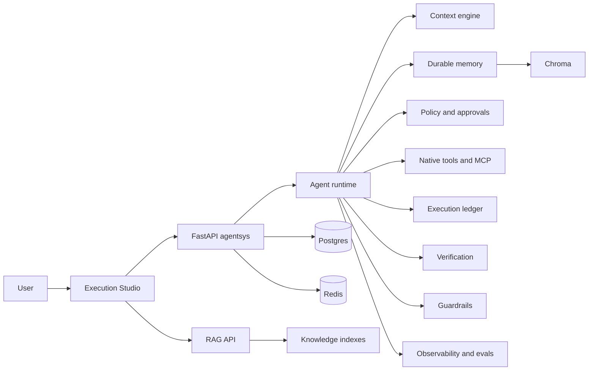

# AgentForge

AgentForge is a production-oriented AI Agent Execution Studio. It makes agent
behavior visible: the user can give a goal, watch live execution, inspect graph
nodes, review context and memory, approve external effects, and revisit durable
execution history after the run completes.

The current product UI is the Next.js Execution Studio in `web/`:

- Mission Control to start or resume work.
- Workspace with Chat + Live Execution Graph + Inspector + Timeline for one
  active run.
- Runs and Run Detail for execution history.
- Approvals with exact-effect authorization.
- Knowledge and Memory inspection.
- Tool, MCP, Integration, Policy, Eval, Observability, Security, and Settings
  surfaces that expose current backend capability honestly.



## Portfolio Quick Read

What this demonstrates:

- A continuous agent loop, not a static workflow graph.
- Durable run state in Postgres; SSE is live narration, not source of truth.
- Human approval for external or risky effects.
- Policy-enforced tool execution.
- Gmail draft creation, not Gmail send.
- Long-term memory with Chroma plus Postgres metadata.
- RAG document ingestion, retrieval playground, source scores, and verification.
- MCP tool discovery with trust gaps surfaced honestly.
- Context budgeting and rolling-summary support where backend metadata exists.
- Agent-specific observability, deterministic safety evals, and safe security
  metadata.

Release/deployment documentation:

- Local run instructions are below.
- Free portfolio deployment plan: [docs/DEPLOYMENT.md](docs/DEPLOYMENT.md).
- Product UX architecture: [docs/PHASE9A_PRODUCT_UX_ARCHITECTURE.md](docs/PHASE9A_PRODUCT_UX_ARCHITECTURE.md).

Known portfolio limitations:

- Cloud deployment requires a separate API service, worker service, Postgres,
  Redis, and vector persistence.
- Free hosts generally do not expose Docker sockets, so `code_execution` should
  be disabled with `ENABLE_CODE_EXECUTION=false`.
- RAG and memory persistence require Chroma with persistent disk or a future
  vector-store migration.
- DeepEval quality scores are not shown unless eval results are actually run
  and exposed.
- Security screens use safe metadata only; raw secrets and attack payloads are
  intentionally not rendered.

A multi-agent system — a continuous agent loop understands the request, takes one step at a time,
and decides what's next in light of what it just learned; Specialists execute with tools; a
Reviewer validates each step — with persistent memory, human-in-the-loop escalation, and full
execution tracing. Built to demonstrate what makes an agent system production infrastructure
rather than a single-agent chat-loop demo: it can be paused, handed to a human, resumed by a
different process entirely, and every decision it made is inspectable afterward.

## Two packages in this repo

| Package | What it is | Docs |
|---|---|---|
| **`src/agentsys/`** | The agent platform described below: a continuous reasoning loop, sub-agent delegation, tool use, human escalation, tracing, and an MCP plugin backbone for connecting third-party tools. | this file |
| **`src/rag/`** | A hybrid-search RAG pipeline (dense + BM25 → RRF → LLM rerank → grounded generation → per-claim citation verification), with a 50-case golden-set eval across three chunking strategies. | [docs/RAG_PIPELINE.md](docs/RAG_PIPELINE.md) |

They were separate projects and were merged into one repository, with both git
histories preserved. Neither imports the other — see
[docs/MERGE.md](docs/MERGE.md) for what had to be reconciled, the known
Chroma-mode inconsistency, and how to run both stacks.

If you're evaluating system direction, also see
[docs/GOAL_EXECUTION_SYSTEM.md](docs/GOAL_EXECUTION_SYSTEM.md) for AgentForge's
north-star definition as a goal-execution agent (not just a chat loop).

```bash
docker compose up -d --build
```

Docker now manages the full local stack: Execution Studio on `3000`, agentsys API on
`8100`, RAG API on `8000`, Streamlit dashboards on `8601`/`8501`, plus Postgres,
Redis, Chroma, and the Celery worker.

## Proof it actually works

A real task run end-to-end through the full Docker stack (Postgres + Redis + Chroma + Celery
worker + FastAPI), not a mocked demo:

> **Request:** "Using our metrics database, find Cedar Analytics' revenue for 2026-Q1 and
> 2026-Q2, calculate the percentage growth between them, and save a short summary report to a
> file called report.txt."

| Step | Tool | Result |
|---|---|---|
| Query both quarters | `db_query` | `2026-Q1: $9,600,000`, `2026-Q2: $10,450,000` |
| Compute growth | `code_execution` (sandboxed, retried once) | `8.854166666666668` |
| Write report | `file_io` | `report.txt` written to the task's sandboxed workspace |

> **Final answer:** "Cedar Analytics' revenue for 2026-Q1 is $9,600,000 and for 2026-Q2 is
> $10,450,000. The percentage growth between 2026-Q1 and 2026-Q2 is approximately 8.85%. A
> summary report has been saved to the file..."

The math checks out ((10.45M − 9.6M) / 9.6M = 8.854...%), the report file is real and correct,
and the sketch/decide/execute/review/synthesize sequence is fully visible in the trace explorer.

**61 agentsys tests** (72 across both packages in this repo), all passing on a clean run —
occasionally 1-2 skip cleanly on DuckDuckGo rate-limiting, an external-network condition the tool
already handles gracefully, not a code bug. Real Postgres, real Redis, real Chroma, real OpenAI
calls, real Docker-sandboxed code execution — nothing mocked. See [Tests](#tests).

## Architecture

```
Request
  │
  ▼
┌─────────────────────┐   reads long-term memory for similar past tasks
│  Supervisor: sketch  │──────────────────────────────────────────────►  Chroma
│  (non-binding outline)│
└─────────┬────────────┘
          │ low confidence → escalate; otherwise loop starts (no Subtask rows yet)
          ▼
┌──────────────────────────┐◄──────────────────────────────────────┐
│  agent_step               │                                       │
│  decide next step, given  │                                       │
│  request + sketch (advisory)                                      │
│  + everything done so far │                                       │
└───┬──────────────┬────────┘                                       │
    │ act           │ finish (≥1 step done)                          │
    ▼               ▼                                                │
 create Subtask   synthesize                                         │
 on the fly           │                                        ┌─────┴────┐
    ▼                 ▼                                        │  review   │
┌─────────────────────┐   tool call, logged   ─────────────────►│(Reviewer) │
│ Specialist: execute  │──────────────────────                 └────┬──────┘
│ (tool chosen by the  │                                            │ reject (retries left)
│  agent_step decision)│                                            │
└──────────┬───────────┘                                            │
           │                                                        ▼
           └─────────────────────────────────────────────────► execute (retry, with
                                                                  reviewer feedback this time)
                                                                        │
                                                                        │ reject (exhausted) /
                                                                        │ step budget exhausted /
                                                                        │ finish before any step /
                                                                        │ low sketch confidence
                                                                        ▼
                                                                 ┌──────────────┐
                                                                 │  Escalation   │──► human via
                                                                 │  (pause task) │    dashboard/API
                                                                 └──────┬────────┘
                                                                        │ approve / reject / take over
                                                                        ▼
                                                              run_agent_task.delay() again —
                                                              a FRESH graph invocation that reads
                                                              current Postgres state and resumes
```

Execution is deliberately sequential, not parallel: each `agent_step` decision is made in light of
everything the loop has learned so far, so there's no fixed dependency graph left to fan work out
against (see [Known limitations](#known-limitations-honest-not-hidden)). `delegate_subagent`
remains available as an opt-in way to get a bounded, context-isolated multi-step investigation
inside a single step, without polluting the main loop's context with its intermediate tool calls.

Every node writes a `TraceSpan` row (input, output, status, timing) — that's what powers the
trace explorer and the analytics tab, and it's also the audit trail for "why did the agent do
that."

### Why Postgres is the source of truth, not LangGraph's checkpointer

LangGraph ships a built-in checkpointer for exactly this pause/resume pattern. I didn't use it.
The `AgentState` TypedDict carries almost nothing (`task_id`, plus an in-memory `route` scratch
field) — every node reads what it needs from Postgres and writes back to Postgres, including
`agent_step_node`'s own step counter, which is just `len(Subtask rows for this task)` rather than
anything carried in graph state. This
means "resume after a human approves" is just *calling `run_task(task_id)` again* — a completely
fresh graph invocation, often from a different Celery worker process than the one that paused. I
chose this over the built-in checkpointer because I wanted the resume path to be the exact same
code path as a fresh run (no separate "restore a checkpoint" logic to get right, and no risk of a
stale in-memory state surviving a worker restart) — proven directly by
`test_escalation_take_over_resumes_and_completes_task`, which forces a real pause and resume
across the boundary and asserts the final state is correct.

### Short-term memory (Redis) vs. `AgentState` — why both exist

`AgentState`'s `route` field is pure in-memory control flow — it never needs to outlive a single
`graph.invoke()` call, so LangGraph threading it between nodes in-process is sufficient; Redis
would be redundant overhead. Redis-backed short-term memory
(`memory/short_term.py`) serves a different, genuine purpose instead: a scratchpad specialists
write informal notes to *across subtasks within the same task* (e.g. "web_search on X found Y"),
included in later subtasks' prompts, and explicitly cleared on task completion. Two different
lifetimes, two different mechanisms — not the same thing wearing two names.

## Real bugs found and fixed while building this

Listed because they're more informative than a feature list — this is what building and actually
running a multi-agent system surfaces that a spec doesn't.

1. **Reject-and-revise wasn't revising.** A rejected subtask retried with the *identical* failing
   SQL query twice, because the specialist's retry prompt never included *why* the reviewer
   rejected it — just "try again." Fixed by fetching the latest `Review.feedback` for the subtask
   and injecting it into the retry prompt (`_revision_feedback` in `graph/nodes.py`). Also fixed
   the underlying cause: the `db_query` tool's description didn't state the exact data format
   (`'2026-Q1'`, not `'Q1 2026'`), so the specialist was guessing blind — giving it that
   information upfront matters more than a smarter retry loop.

2. **A malformed tool call crashed the whole graph run.** The specialist LLM constructed
   `{"query": "..."}` for a tool whose actual parameter is `sql`, and `tool.run(**kwargs)` raised
   `TypeError`, taking down the entire task. A wrong argument name is a fixable mistake, not a
   system failure — it's now caught and converted into a failed `ToolResult`, so the reviewer
   sees it as a normal rejectable output and the retry loop handles it like any other bad attempt.

3. **Synthesis fabricated a data point that was never retrieved.** Under the original one-shot
   planning architecture, the planner produced a single Q1-only subtask for a request that needed
   both quarters (its own plan reasoning literally said *"I can create a second subtask later"* —
   which that architecture didn't support). Synthesis then filled the gap by inventing a plausible
   Q2 figure, formatted to look like it was quoting a real subtask result. It happened to land on
   the correct seeded value, which made it *more* concerning, not less — a confidently fabricated
   number is worse than an obviously wrong one. Fixed at both ends: the planning prompt stated
   explicitly that deferring work to an imagined future subtask wasn't allowed, and
   `SYNTHESIS_PROMPT` explicitly forbids inventing any data point not present in actual subtask
   outputs, instructing it to state what's missing instead. After the later move to a continuous
   reasoning loop (see Architecture), the completeness guardrail moved into `AGENT_STEP_PROMPT`
   ("don't finish having quietly skipped part of what was asked"), while `SYNTHESIS_PROMPT`'s
   no-fabrication instruction is unchanged. Locked in by
   `test_synthesis_does_not_fabricate_data_beyond_what_subtasks_actually_retrieved`, which
   verifies every dollar figure in a final answer traces back to a real tool call result.

4. **`code_execution` silently produced no output.** The specialist generated `sum_headcount`
   (a bare expression) instead of `print(sum_headcount)` — correct arithmetic, zero visible
   output, since script execution doesn't echo expressions the way a REPL does. The reviewer
   correctly caught it (empty stdout) and escalated after retries all made the same mistake. Fixed
   by stating this explicitly in the tool's description rather than hoping the model infers it.

5. **A port collision, discovered from the *other* project.** Both this project's and the RAG
   project's `docker-compose.yml` defaulted to host ports 8000/8501. With both stacks running,
   Windows silently routed `localhost:8000` to whichever container's proxy bound first, producing
   a confusing 404 in an unrelated app. Remapped this project's `api`/`dashboard` to 8100/8601.

None of these were caught by writing the code carefully — they were caught by actually running it
against real services and real LLM calls and checking the output, the same standard this project
holds retrieval and generation to elsewhere.

## Tools

| Tool | What it does | Real safety property, not just a description of one |
|---|---|---|
| `db_query` | Read-only SQL against a seeded `sample_metric` table | Word-boundary regex blocks DML/DDL/multi-statement SQL *before* execution, plus a Postgres-level read-only transaction as defense in depth. Tests verify blocked `DROP`/`DELETE`/injection attempts leave row counts unchanged — not just that an error was returned. |
| `code_execution` | Runs Python in an ephemeral Docker container | `network_disabled=True`, memory/process-count caps, and an empirically-verified timeout (proven by a test that a 30s sleep with `timeout_s=3` returns in ~3s, not 30) — `docker-py`'s `wait(timeout=...)` is a client-side read timeout, not container-side enforcement, so the tool explicitly kills the container itself. Not a hardened boundary against a determined attacker (container escapes are a known risk class) — a real sandbox against accidents and casual misuse. |
| `file_io` | Read/write/list inside a per-task sandboxed workspace | Every path is resolved and checked with `is_relative_to()` against the task's workspace directory *before* any filesystem access — both relative (`../../evil.txt`) and absolute traversal attempts are blocked and verified (by test) to never touch the filesystem outside the sandbox. |
| `web_search` | DuckDuckGo HTML scrape (no paid search API budget) | Retries once on bot-detection, reports clearly on failure rather than crashing or returning garbage. This is the deliberately weakest link — documented, not hidden: a production system would swap this for Tavily/Serper/Bing. |

## Memory

- **Short-term** (Redis): per-task scratchpad, cleared at task completion (`short_term.clear`).
- **Long-term** (ChromaDB + Postgres metadata): episodic summaries written after every completed
  task, retrieved during planning for similar future requests. Retrieval ranks by a *blend* of
  semantic similarity and stored importance (`0.7 × similarity + 0.3 × importance/5`), not
  similarity alone — a highly important preference should surface even as a middling semantic
  match. `prune_low_value_memories` caps growth by dropping the least important, least recently
  accessed entries once the store passes a size threshold.

## Policy: the LLM proposes, deterministic code disposes

Whether a tool call is *allowed* is never the model's decision. Every proposed call passes two
deterministic gates before anything runs, and neither one is reachable by anything the model
writes:

```
LLM proposes a tool call
        ↓
typed validation      tools/base.py -- validated_kwargs, against the tool's pydantic args model
        ↓
policy.decide(...)    policy.py -- pure function of (tool, validated args)
        ↓
ALLOW / REQUIRE_APPROVAL / DENY
        ↓
existing execution  /  existing escalation  /  refused with a reason
```

Each tool declares an `action_type` (`READ` / `LOCAL_WRITE` / `EXTERNAL_WRITE` / `DESTRUCTIVE`)
and a `risk` (`LOW` / `MEDIUM` / `HIGH` / `CRITICAL`); `policy.py` holds the whole ruleset as one
function. Four properties that are easy to claim and easy to get wrong:

- **Decisions are per-call, not per-tool.** `file_io` reading its workspace is an allowed
  `READ`/`LOW`; the same tool with `action="write"` is a gated `LOCAL_WRITE`/`MEDIUM`. This
  replaced a boolean on a Python class that only two of fifteen tools set.
- **It fails closed, in three places.** An exception anywhere in the rule body returns `DENY`
  rather than propagating (a policy engine you can open by breaking it is not one). A tool that
  declares no classification inherits `EXTERNAL_WRITE`/`HIGH` and is gated — "the author forgot"
  and "this is safe" must not look alike. A third-party MCP server's tools are gated unless an
  operator declares that server read-only.
- **Both execution seams are gated.** The main loop *and* `delegate_subagent`'s inner loop. The
  sub-agent seam previously had no approval check at all, so a sub-agent proposing
  `code_execution` just ran it — approval was bypassable by delegating. A sub-agent can't pause
  for a human, so it refuses gated actions and reports that they need their own approved step.
- **An approval binds to the exact call it approved.** The escalation stores the tool name, the
  validated arguments, the decision and a fingerprint; at resume all three are re-checked, so
  approving `send_email(to=A)` cannot resume as `send_email(to=B)`, and an approval older than
  `approval_expiry_seconds` is refused rather than executed against a world that has moved on.

Not implemented, and not faked: step-up/MFA. `UserSession.mfa_satisfied_at` exists in the schema
but nothing writes it and there is no second factor in the auth flow, so a "require recent MFA"
rule would check a column that is always `NULL`. Tracked as debt in
[docs/ARCHITECTURE_AUDIT.md](docs/ARCHITECTURE_AUDIT.md), not shipped as a control.

## Human-in-the-loop

Escalation triggers: a policy decision of `REQUIRE_APPROVAL` on a proposed tool call (see above),
low sketch confidence, exhausted subtask retries, a reviewer explicitly
flagging `escalate`, the step budget (`max_task_steps`) being exhausted, or the agent declaring
"finish" before completing any step. Three resolution levels via
`POST /v1/escalations/{id}/decide`:

- **approve** — accept the subtask's output as-is (or resume a task-level escalation as-is)
- **reject** — mark the subtask failed (or the whole task, for a task-level escalation)
- **take_over** — human supplies the correct output directly, subtask marked done with it

All three were exercised against the real running stack, not just unit-tested — see the escalated
headcount-sum case resolved via `take_over` in the dashboard's Approvals tab during development.

## Running it

### Docker (recommended — this is how it was actually tested)

```bash
cp .env.example .env   # fill in OPENAI_API_KEY
docker compose up -d --build
```

Services: `web` (3000), `postgres` (5432), `redis` (6379), `chroma` (8001), `api` (8100),
`rag-api` (8000), `dashboard` (8601), `rag-dashboard` (8501), and `worker` (Celery, no
exposed port). The `web` service runs Next.js from `web/` with Docker-owned `node_modules`
and `.next` volumes, so host-side `.next` cache corruption does not affect the browser UI.
The `worker` container needs the Docker socket mounted
(`/var/run/docker.sock`) to run the `code_execution` tool's sandboxed containers — a known,
documented pattern (Docker-in-Docker via socket sharing) with its own security tradeoff: a
process that can launch sibling containers has a wider blast radius than one that can't. Fine for
a portfolio/demo context; worth a real look before this pattern goes anywhere near untrusted
multi-tenant input.

```bash
python scripts/seed_sample_db.py   # seeds sample_metric with demo data
```

### Local (venv)

```bash
python -m venv .venv && .venv/Scripts/activate
pip install -r requirements.txt && pip install -e .
# point .env at Postgres/Redis/Chroma however you're running them locally
uvicorn agentsys.main:app --reload
celery -A agentsys.worker.celery_app worker --loglevel=info --pool=solo   # separate terminal
streamlit run src/agentsys/dashboard.py
```

## API

- `POST /v1/tasks` — submit a request, returns immediately with `status: pending`, executes async
- `GET /v1/tasks/{id}` — status, subtasks, final output
- `GET /v1/tasks/{id}/trace` — full ordered span history for that task
- `GET /v1/escalations?status=pending` — the approval queue
- `POST /v1/escalations/{id}/decide` — approve / reject / take_over
- `GET /v1/memory` — long-term memory entries
- `GET /v1/analytics` — tool success rates, avg latency, task/escalation counts
- `GET /v1/tools` — registered tool names and descriptions
- Interactive docs at `/docs`

## Tests

```bash
pytest tests/ -v
```

- `test_graph_routing.py` (4, no LLM calls) — deterministic control-flow logic: sketch vs. resume
  routing, sketch fallback, step-budget escalation.
- `test_graph_integration.py` (12, real LLM + tools) — full task lifecycle, incremental step
  creation on a real agent loop, reject-and-revise actually revising, the fabrication regression
  test, human-in-the-loop resume (both `take_over` and task-level `reject`), memory-informed
  retrieval, sketch creates no committed work, the loop stops on a genuine "finish" decision, the
  step budget escalates cleanly.
- `test_tool_*.py` (43) — one file per tool (including `delegate_subagent`, the bounded isolated
  sub-loop), each hitting real Postgres / real Docker / real filesystem / real MCP servers / real
  (or gracefully-failing) network.
- `test_memory.py` (2) — short-term roundtrip+clear, long-term similarity+importance ranking.

## Known limitations (honest, not hidden)

- **No parallel execution.** The continuous reasoning loop is deliberately sequential — each step
  is decided in light of everything learned from every prior step, so there's no fixed dependency
  graph to fan independent work out against (an earlier version of this architecture used a fixed
  upfront plan specifically to enable that; see Architecture above for why it was replaced). A
  request with genuinely independent sub-parts runs them one after another rather than
  concurrently. `delegate_subagent` remains available for bounded isolated exploration inside a
  single step; true parallel fan-out (a decide-call naming multiple independent next steps at
  once) is a real, well-scoped extension, not built here.
- **"Replay" is a trace step-through, not re-execution.** The trace explorer lets you inspect
  every past decision in order; it doesn't yet let you modify an input and re-run from that point
  for comparison, which the fuller blueprint envisions. A natural extension, not built here.
- **Reviewer and specialist share the same model family** (gpt-4o-mini for both, by default). A
  reviewer sharing blind spots with the thing it's reviewing can miss what a genuinely independent
  judge would catch — using a different model for review would be a meaningful strengthening, not
  just a cost/latency tradeoff.
- **`web_search` is the deliberately weak tool** — see the Tools table. Documented, not hidden,
  because pretending a scraped DuckDuckGo endpoint is production-reliable would be worse than
  admitting it isn't.
